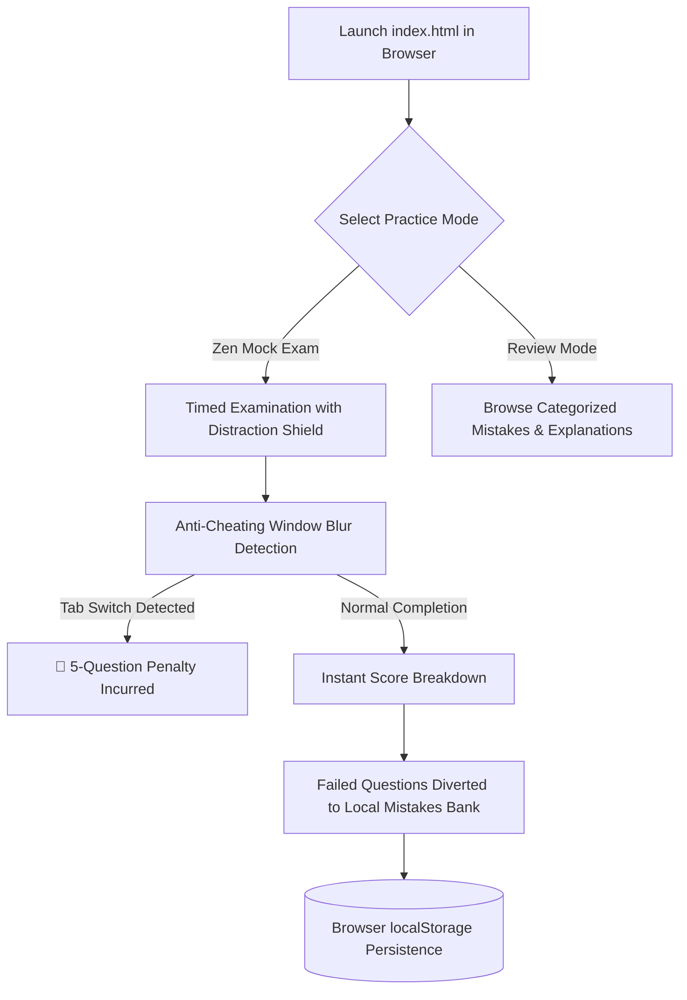

# 🩺 FCPS Pro QBank — Zero-Dependency Zen-Mode Exam Simulator

<div align="center">

[](https://developer.mozilla.org)
[](https://w3.org)
[](https://w3.org)
[](#)
[](https://pages.github.com)
[](LICENSE)
[](https://github.com/muhammadokashapak)

<p align="center">
  <strong>Ultra-Lightweight, Distraction-Free Clinical Examination Testing Engine with Anti-Cheating Penalties and Local Mistake Review Bank</strong>
</p>

[📖 Overview](#-overview) •
[✨ Key Innovations](#-key-innovations) •
[🧠 Anti-Cheating & Mistake System](#-anti-cheating--mistake-review-system) •
[📂 Directory Structure](#-directory-structure) •
[🚀 Instant Launch Guide](#-instant-launch-guide) •
[👨‍💻 Author](#-author--connect)

---

</div>

## 📖 Overview

When preparing for high-stakes medical examinations like **FCPS Part 1**, candidates often struggle with software that is sluggish, cluttered with advertisements, or dependent on continuous internet connections.

**FCPS Pro QBank** was designed with a single uncompromising philosophy: **Zero latency, total focus, and zero setup**. Written entirely in clean, vanilla web technologies, the app runs instantly in any modern web browser on smartphones, tablets, laptops, or desktops without requiring databases, API tokens, or server environments.

---

## ✨ Key Innovations



### Core Features
- 🧘 **Zen-Mode Distraction Shield:** Hides navigation bars, sidebars, and notifications during active mock exams to replicate strict exam hall conditions.
- ⚡ **Instant Zero-Config Boot:** Pure HTML5/CSS3/ES6 implementation. Requires no `npm install`, no backend servers, and zero configuration.
- 💾 **Permanent Offline Persistence:** Utilizes browser `localStorage` to preserve user mistake registries, exam scores, and answered state across sessions.
- 📱 **Fully Responsive Typography:** Fluidly scales across mobile screens, iPads, Android tablets, and ultrawide desktop monitors.

---

## 🧠 Anti-Cheating & Mistake Review System

### 1. Tab-Switching Penalty Engine
To cultivate authentic exam discipline and discourage candidates from searching Google or looking up notes mid-test, the app monitors `window.onblur` and `document.visibilitychange` events. If a candidate leaves the exam tab:
- A prominent alert notification is issued.
- A **strict 5-MCQ penalty** is logged against the active test session.
- The unattempted questions are returned to the unseen pool for future remediation.

### 2. Autonomous Mistakes Bank
Every question answered incorrectly is automatically flagged and saved into a dedicated **Mistakes Bank**. Candidates can enter this dedicated review mode to study detailed rationales, clinical pearls, and high-yield mnemonics without resetting their primary mock test metrics.

---

## 📂 Directory Structure

```
FCPS-Quiz-App/
│
├── index.html                 # Semantic single-page application entrypoint
├── app.js                     # Core exam state engine & anti-cheat handlers
├── style.css                  # Zen-mode aesthetic styling & dark themes
├── app_main.py                # Optional standalone desktop Python launcher
├── FCPS_Pro_QBank.spec        # Standalone PyInstaller desktop specification
├── fcps_quiz_installer.iss    # Inno Setup Windows installer script
├── LICENSE                    # Open-source MIT License
└── README.md                  # VIP Master Architecture Documentation
```

---

## 🚀 Instant Launch Guide

### Immediate Browser Execution
1. Clone or download this repository:
   ```bash
   git clone https://github.com/muhammadokashapak/FCPS-Quiz-App.git
   cd FCPS-Quiz-App
   ```
2. Simply double-click `index.html` to open it in Chrome, Edge, Safari, or Firefox.
3. Start practicing instantly!

### One-Click Free Online Hosting (GitHub Pages)
1. Fork or push this repository to your GitHub account.
2. Navigate to **Settings -> Pages**.
3. Under **Branch**, select `main` and root `/`, then click **Save**.
4. Your application will be live at `https://<username>.github.io/FCPS-Quiz-App/` within 60 seconds!

---

## 👨‍💻 Author & Connect

**Muhammad Okasha**  
*AI & Medical Technology Software Architect*  
- **GitHub:** [@muhammadokashapak](https://github.com/muhammadokashapak)
- **Repository:** [FCPS-Quiz-App](https://github.com/muhammadokashapak/FCPS-Quiz-App)

---

## 📄 License
This project is licensed under the [MIT License](LICENSE).
